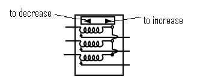
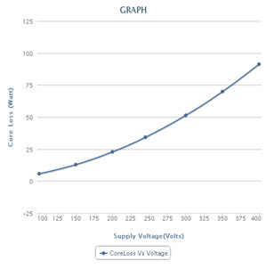

### no load test on three phase induction motor
1. NO load is connected to Induction motor so as to carry out NO load test on induction motor.
2. Close the TPST (Triple Pole Single Throw) switch connecting three phase mains supply to induction motor.
3. Start the motor by applying reduced voltage to the stator.
4. Gradually increases the voltage to its rated value.
5. Now increase the voltage by clicking the arrows on three phase variac

6. As we go on increasing the supply voltage we can observe the change in speed of motor in digital tachometer.

7. Observe the readings of voltmeter, ammeter, wattmeters and tachometer at various stator input voltages.
8. Store the data by clicking "Start Storing Data" at various i/p voltages
9. Go on repeating this procedure till sufficient readings are stored.
10. Now display the data by clicking "Show data". It will display data as shown.

11. Now select one of the graph from available graphs and use "Generate graph" to plot the graph .For Ex.

 

12. While switching off, gradually decrease the voltage applied to motor and make it zero.
13. Open the TPST switch.

