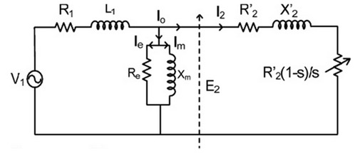

### Theory

A large percentage of the electrical power generated in the world is consumed by induction motors, as these are the main drive motors used in the industries. Practicing engineers should be conversant with the performance characteristics. Equivalent circuit parameters of the machine should be known for predicting the performance. While motor designer calculates the parameters using design details, measured values are preferable for prediction.

### The steady-state performance of a poly-phase induction motor can be obtained using per phase equivalent circuit.
The symbols are,
* V1 = input voltage per Phase
* R1,X1 = resistance and leakage reactance of the stator per phase
* R2,X2 = resistance and leakage reactance of the rotor per phase
* Xm= magnetizing reactance
* Rc= core loss resistance
* I1, I2 = stator and rotor currents (referred to stator) per phase.

The developed torque is given as,
T=3(I2)2R2/(s&omega;s) N-m

Where,
* &omega;s = synchronous speed in radians/sec
* &omega;r = rotor speed in radians/sec
* s = slip.

The parameters could be determined by 'no-load' and 'blocked-rotor' tests,
the former determines Rc and Xm while the latter yields R1, R2, X1, X2.
Following equations could be used

* X1 = R1+jX1
* X2 = R2/S+jX2
* S = &omega;s-&omega;r/&omega;
* The Torque T = 3(I2)2R2/s
* Input power = 3V1*I1*pf
* Output power = (1-S) &omega;s

Per phase equivalent circuit of a poly phase induction motor

Start the motor by applying the normal frequency reduced voltage to the stator and gradually increases the voltage to its rated value under no load condition. In case of slip-ring motor short circuit the slip rings before starting. Note down the readings of voltmeter, ammeter, wattmeters and tachometer at different voltages.

